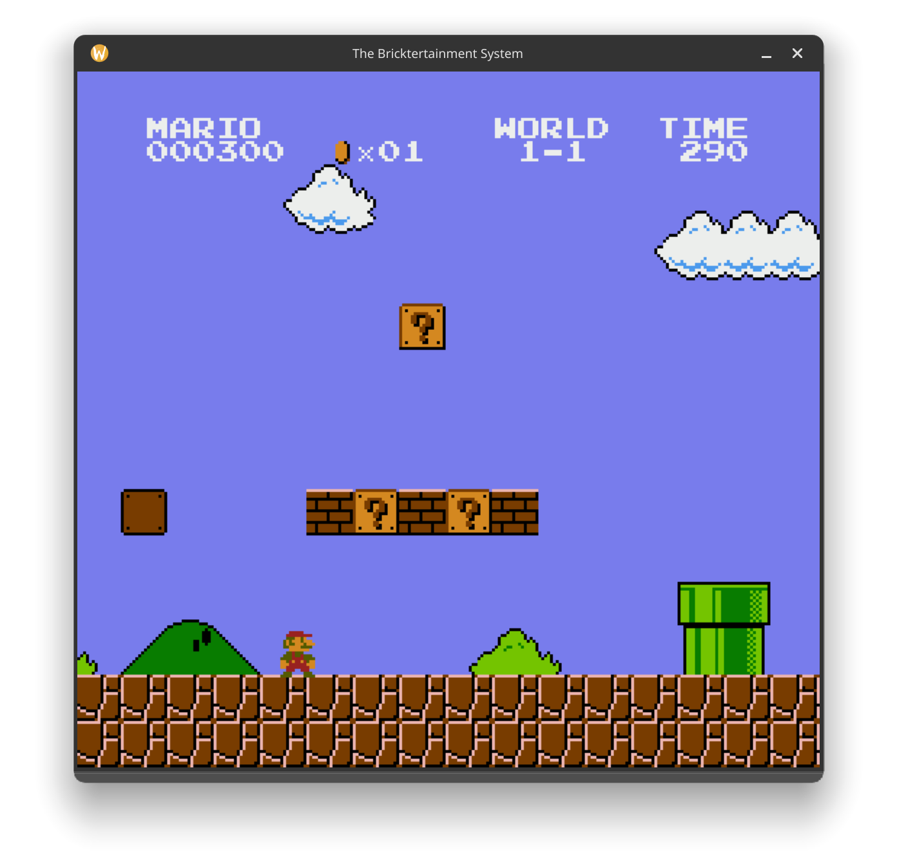

# The Bricktertainment System

<p align="center">
  
</p>

A from-scratch Nintendo Entertainment System emulator written in modern C++, powered by SDL3.

## Features

### CPU

- Ricoh 2A03-compatible CPU core with the official 6502 instruction set and addressing modes
- Instruction cycle counts, branch and page-crossing penalties, stack behavior, and the indirect `JMP` wraparound bug
- Reset, BRK, and PPU-generated NMI handling
- CPU-visible RAM and register routing through a dedicated CPU bus

### PPU

- 256x240 ARGB framebuffer
- Background rendering from pattern tables, nametables, attribute tables, and palettes
- 8x8 sprite rendering with palette selection, priority, horizontal and vertical flipping, and sprite-zero hit detection
- Scrolling, nametable selection, grayscale mode, and left-edge background and sprite masking
- Horizontal, vertical, and four-screen nametable mirroring
- PPU registers, buffered VRAM reads, VBlank/NMI behavior, and OAM DMA

### APU

- Two pulse channels, triangle channel, and noise channel
- Length counters, envelopes, timers, sequencers, and a first-pass frame counter
- NES nonlinear channel mixing into a 48 kHz mono SDL3 audio stream
- Preliminary DMC output and memory-reader pipeline with CPU DMA stalls

### System

- iNES cartridge loading for Mapper 0/NROM ROMs
- 16 KB and 32 KB PRG ROM, CHR ROM, and CHR RAM support
- Keyboard-backed NES controller with serial strobe behavior
- SDL3 video, input, and audio output
- Unit tests for the CPU, buses, cartridge, PPU, and APU

## Compatibility

For now, only NTSC Mapper 0 games are supported.

## Requirements

- CMake 3.20 or newer
- A compiler with C++23 support
- SDL3 development files, including its CMake package configuration

## Build

```bash
git clone https://github.com/nsameron2/the-bricktertainment-system.git
cd the-bricktertainment-system
cmake -S . -B build
cmake --build build --parallel
```

If SDL3 is installed in a custom location, add its prefix to `CMAKE_PREFIX_PATH` when configuring the project.

## Run

Pass the emulator exactly one `.nes` ROM path:

```bash
./build/BricktertainmentSystem path/to/game.nes
```

ROM files are not included in this repository. Use ROM dumps that you are legally permitted to use.

## Controls

| NES button | Keyboard |
| --- | --- |
| D-pad | Arrow keys |
| A | `Z` |
| B | `X` |
| Select | `Space` |
| Start | `Enter` |

Close the window to stop the emulator.

## Tests

Build the project, then run every test target through CTest:

```bash
ctest --test-dir build --output-on-failure
```

## Architecture

| Component | Responsibility |
| --- | --- |
| `CPU` | Executes 2A03/6502 instructions and handles reset and NMI |
| `CPUBus` | Routes CPU RAM, PPU/APU registers, controllers, cartridge space, and DMA |
| `PPU` | Produces frames, exposes CPU-visible registers, and maintains PPU state |
| `PPUBus` | Routes pattern, nametable, and palette memory with mirroring |
| `Cartridge` | Parses iNES files and maps NROM PRG/CHR data |
| `APU` | Clocks audio channels, mixes samples, and feeds SDL3 audio |
| `Controller` | Models the NES controller latch and serial shift register |
| `Display` | Presents the framebuffer and translates SDL3 keyboard events |

The CPU and PPU use separate address spaces and buses, matching the physical console. `main.cpp` acts as the system clock: it advances the PPU three times per CPU clock, accounts for DMA stalls, clocks the APU, and presents completed frames.

## Project Layout

```text
assets/      Static media and other project resources
include/     Component interfaces
src/         Emulator and SDL3 implementations
tests/       Standalone unit-test targets
CMakeLists.txt
```

## References

Hardware behavior was implemented with substantial help from the [NESdev Wiki](https://www.nesdev.org/wiki/Nesdev_Wiki). The emulator core itself is written from scratch as a learning project.
